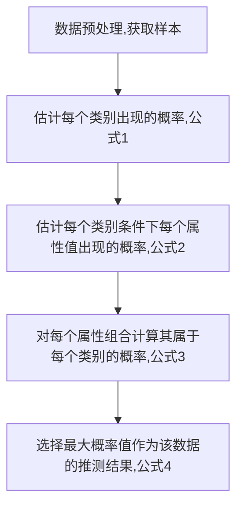

# 朴素贝叶斯

在概率论与统计学中, 贝叶斯定理 (Bayes' theorem) 表达了一个事件发生的概率, 而确定这一概率的方法是基于与该事件相关的条件先验知识 (prior knowledge). 而利用相应先验知识进行概率推断的过程为贝叶斯推断 (Bayesian inference)

## 朴素贝叶斯特点

优点: 在数据较少的情况下仍然有效, 可以处理多类别问题

确定: 对于输入数据的准备方式较为敏感???

使用数据类型: 标称型数据

## 贝叶斯定理

条件概率 (conditional probability) 是指在事件 B 发生的情况下, 事件 A 发生的概率. 通常记为 P(A|B).
$$
P(A|B)=\frac{P(A,B)}{P(B)}\\
P(A,B)=P(A|B)P(B)=P(B|A)P(A)\\
P(B|A)=\frac{P(A|B)P(B)}{P(A)}
$$

## 贝叶斯推断

贝叶斯公式中, P(A)称为"先验概率"(Prior probability), 即在B事件发生之前, 对A事件概率的一个判断. P(A|B)称为"后验概率"(Posterior probability), 即在B事件发生之后, 对A事件概率的重新评估. P(B|A)/P(B)称为"可能性函数"(Likelyhood), 这是一个调整因子, 使得预估概率更接近真实概率. 

所以, 条件概率可以理解成下面的式子：后验概率＝先验概率 ｘ 调整因子

这就是贝叶斯推断的含义. 我们先预估一个"先验概率", 然后加入实验结果, 看这个实验到底是增强还是削弱了"先验概率", 由此得到更接近事实的"后验概率". 因为在分类中, 只需要找出可能性最大的那个选项, 而不需要知道具体那个类别的概率是多少, 所以为了减少计算量, 全概率公式在实际编程中可以不使用. 

而朴素贝叶斯推断, 是在贝叶斯推断的基础上, 对条件概率分布做了条件独立性的假设. 因此可得朴素贝叶斯分类器的表达式. 因为以自变量之间的独立(条件特征独立)性和连续变量的正态性假设为前提, 就会导致算法精度在某种程度上受影响. 

## 朴素贝叶斯的参数推断

实际在机器学习的分类问题的应用中, 朴素贝叶斯分类器的训练过程就是基于训练集 D 来估计类先验概率P(c) , 并为每个属性估计条件概率 P(xi|c) . 这里就需要使用极大似然估计 (maximum likelihood estimation, 简称 MLE) 来估计相应的概率. 

令 Dc 表示训练集 D 中的第 c 类样本组成的集合, 若有充足的独立同分布样本, 则可容易地估计出类别的先验概率, 其中|Dc|表示 c 类样本的个数, |D|表示样本的总数：
$$
P(c)=\frac{|D_c|}{|D|} \tag{公式1}
$$
对于离散属性而言, 令 Dc,xi 表示 Dc 中在第 i 个属性上取值为 xi 的样本组成的集合, Dc,x为Dc中所有属性的总和, 则条件概率 P(xi|c) 可估计为：
$$
P(x_i|c)=\frac{|D_{c,x_i}|}{|D_{c,x}|} \tag{公式2}
$$
对于连续属性可考虑概率密度函数, 假定
$$
p(x_i|c) \sim N(\mu_{c,i},\sigma_{c,i}^2)
$$
μ和sigma分别是第 c 类样本在第 i 个属性上取值的均值和方差, 则有：
$$
P(x_i|c)=\frac{1}{\sqrt{2\pi}\sigma_{c,i}}exp(-\frac{(x_i-\mu_{c,i})^2}{2\sigma_{c,i}^2})
$$

有 d 个属性的样本属于每个类别的概率为:
$$
P(c|x) = P(c)\prod_{i=1}^{d}P(x_i|c) \tag{公式3}
$$
对于离散情况, 如果某个概率值为0, 则公式3进行计算时最后概率为0, 不能真正反映属于某个类别的概率情况, 因而这里计算时取对数, 调整数据的取值范围:
$$
P(c|x) = log[P(c)\prod_{i=1}^{d}P(x_i|c)] = log[P(c)] + log[\prod_{i=1}^{d}P(x_i|c)]]\\
 = log[P(c)] + \sum_{i=1}^{d}log[P(x_i|c)] \tag{公式3-1}
$$

则类别为:
$$
\hat y = \underset{c \in Y}{\operatorname{arg\,max}}P(c|x) \tag{公式4}
$$

## 朴素贝叶斯分类器的训练及预测

**训练**: 计算概率, 即计算公式1和公式2的概率

**预测**: 取概率最大的类别作为分类预测, 即计算公式3和公式4

设类别个数为Y, 样本数量为m, 特征属性个数为n, 则:

训练过程:

1. 利用公式1, 计算每个类别的概率P(c), 其大小为Y*1
2. 利用公式2, 计算c类样本中特征属性xi的条件概率P(xi|c), 其大小为Y*n

预测过程:

1. 新输入的待分类数据为x, 其大小为1*n
2. 计算条件概率P(xi|c)x的结果, 其大小为Y*n
3. 利用公式3计算属于每个类别的概率P(c|x), 其大小为Y*1
4. 利用公式4计算最大概率对应的类别c, 作为预测类别

## 算法流程

实际应用方式：

- 若任务对预测速度要求较高, 则对给定的训练集, 可将朴素贝叶斯分类器涉及的所有概率估值事先计算好存储起来, 这样在进行预测时只需要 “查表” 即可进行判别
- 若任务数据更替频繁, 则可采用 “懒惰学习” (lazy learning) 方式, 先不进行任何训练, 待收到预测请求时再根据当前数据集进行概率估值
- 若数据不断增加, 则可在现有估值的基础上, 仅对新增样本的属性值所涉及的概率估值进行计数修正即可实现增量学习

##### 参考

1. https://www.cnblogs.com/geo-will/p/10468401.html
2. https://www.cnblogs.com/pinard/p/6069267.html
3. https://blog.csdn.net/qiu_zhi_liao/article/details/90671932

